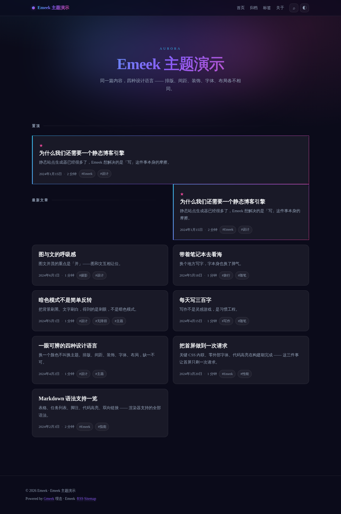
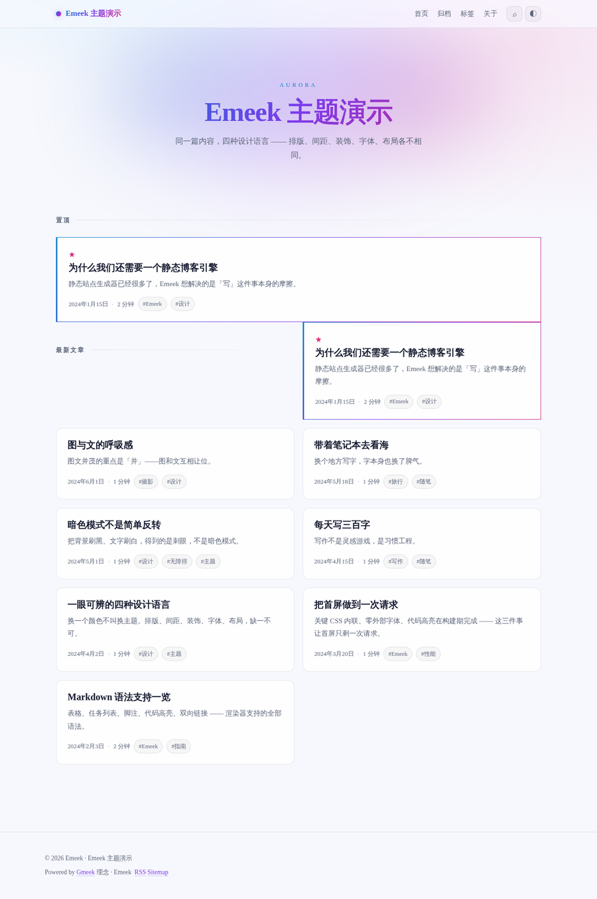
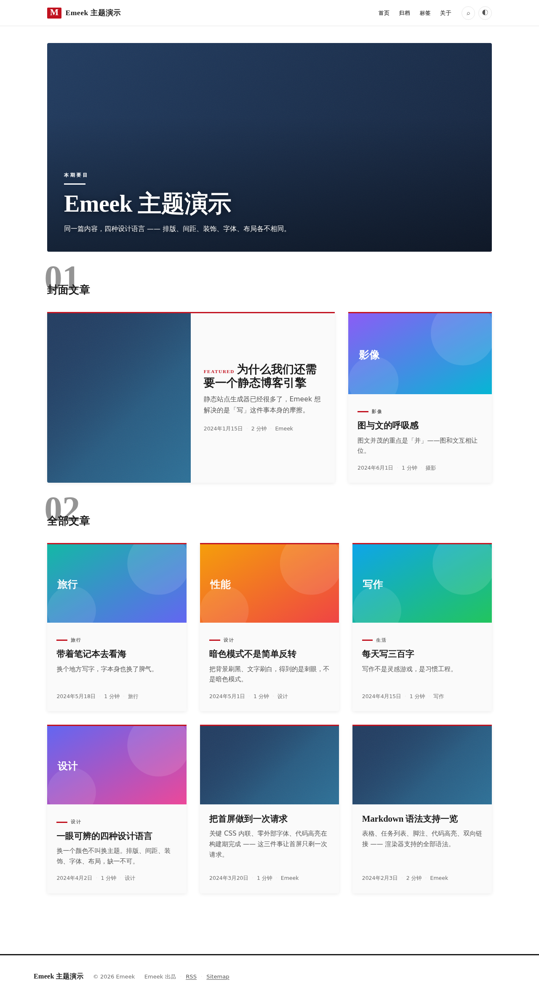
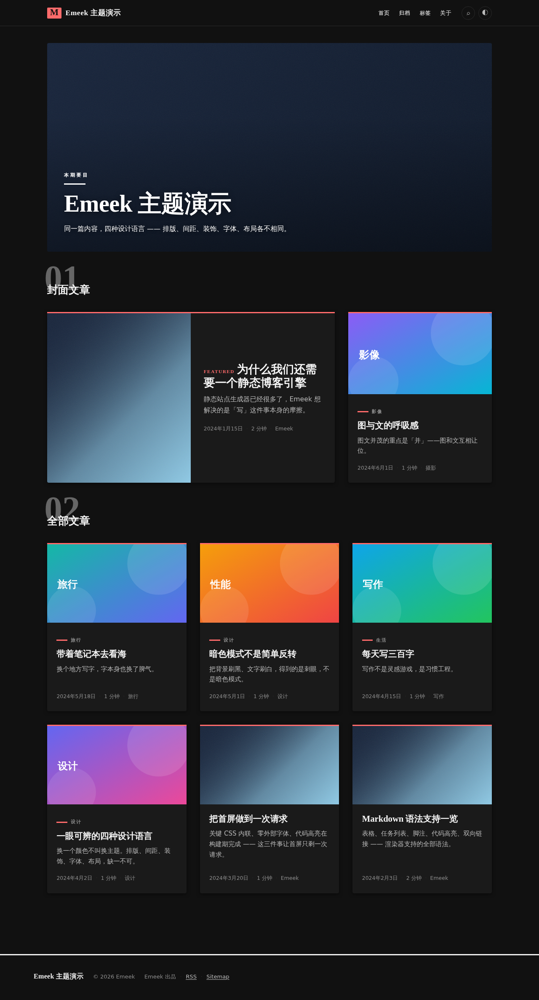

# Emeek

> Extra-ordinary Meek —— 一个用 Markdown 写文章、一条命令构建、零成本部署的知识站引擎。

Emeek 继承 [Gmeek](https://github.com/Meekdai/Gmeek) 的三根支柱：

- **内容即 Issue 或 Markdown** —— GitHub 就是 CMS
- **构建即一条命令** —— `emeeek build`
- **部署即一片静态文件** —— 没有服务器，没有数据库

## 3 分钟跑起来

```bash
# 1. 初始化（生成配置 + 两篇示例文章）
npx emeeek init my-blog
cd my-blog

# 2. 本地预览（保存即重建）
npx emeeek dev
# → http://localhost:3000

# 3. 构建产物
npx emeeek build
# → dist/ 丢到任意静态托管即可
```

不需要配置文件也能构建 —— 所有配置项都有默认值。

## 实测性能

`examples/minimal` 构建产物，Chromium headless + Lighthouse 13.5：

| 页面 | Performance | Accessibility | Best Practices | SEO |
| --- | --- | --- | --- | --- |
| 首页 | 100 | 100 | 100 | 100 |
| 文章页 | 100 | 100 | 100 | 100 |
| 归档 / 标签 / 关于 / 404 | 100 | 100 | 100 | 100 |

单个 HTML 17–23 KB（含内联 CSS 与 JS），**零外部网络请求**。
复现：`node scripts/lighthouse.mjs`

## 用 GitHub Issues 当 CMS

改一行配置，文章就来自 Issue 了：

```javascript
// emeeek.config.js
export default {
  site: { title: '我的博客', url: 'https://yourname.github.io' },
  content: {
    source: 'github-issues',
    repo: 'yourname/yourname.github.io',
    labels: { publish: 'publish', draft: 'draft', pin: 'pin' },
  },
};
```

然后在 `.github/workflows/` 里放上 `build.yml`（仓库里已提供），
在 GitHub 上开 Issue、打上 `publish` 标签，Actions 自动构建并发布到 Pages。

## 写文章

```bash
npx emeeek new "文章标题"
# → posts/2024-04-01-文章标题.md（默认 draft: true）
```

front-matter 字段：

```yaml
---
title: 文章标题
date: 2024-04-01
tags: [标签一, 标签二]
description: 列表页摘要与 SEO 描述
draft: false     # true 则构建时跳过
pinned: false    # true 则置顶
cover: /x.png    # 社交卡片图
lang: zh-CN      # 多语言站点用
slug: custom-url # 自定义 URL
---
```

正文里可以用 `[[文章标题]]` 或 `[[文章标题|显示文字]]` 建立双向链接，
构建期会解析成真实链接，文末还会显示「被引用 N 次」。

## Markdown 能力

自研零依赖渲染器，支持：

表格（含对齐）· 任务列表 · 脚注（带回跳）· 代码高亮（构建期完成）·
引用块 · 有序/嵌套列表 · 双向链接 · 锚点与目录 · 图片懒加载

## 命令

| 命令 | 作用 |
| --- | --- |
| `emeeek init [dir]` | 初始化项目 |
| `emeeek build` | 构建到 `dist/` |
| `emeeek dev [--port 3000]` | 本地预览 + 文件监听 |
| `emeeek studio [--port 3000]` | 写作编辑器（Emeek Studio） |
| `emeeek new "标题"` | 新建文章 |
| `emeeek doctor` | 诊断环境、配置、主题、连通性 |
| `emeeek clean` | 清理产物 |

## Emeek Studio 编辑器

`emeeek studio` 打开写文章用的编辑器。**你在编辑器里看到的效果 = 最终发布的效果** ——
两边调的是同一个渲染函数，一致性测试逐节点盯着这件事。

```
┌──────────────────────────────────────────────────────────┐
│ [B][I]…  [编辑|双栏|预览] 主题  保存  AI          │
├──────────┬────────────────────┬──────────────────────────┤
│ 目录      │  编辑区             │  预览区                  │
│ ▸ 标题1   │  # 标题             │  标题（渲染后）           │
│   ▸ 1.1  │  正文 **加粗**      │  正文「加粗」             │
│ ▸ 标题2   │  ```python          │  ┌────────────┐          │
│          │  print(1)           │  │print(1)    │          │
│          │  ```                │  └────────────┘          │
├──────────┴────────────────────┴──────────────────────────┤
│ 1,234 字 · 约 3 分钟 · 中文 · 行 12, 列 4 · 已保存 ✓      │
└──────────────────────────────────────────────────────────┘
```

- **CodeMirror 6** 内核，可编程扩展，主题热切换不丢光标
- **36 种语言**代码块高亮，语法包按需加载（入口 311KB，语言全在 chunk 里）
- **目录导航**：从语法树抽标题（代码块里的 `#` 不算），点击跳转，光标联动
- **自动补全**：`[[` 文章链接 / <code>```</code> 语言 / `![` 图片 / 行首模板
- **图片拖拽粘贴**：没上传接口时用本地预览，并**明确标记未上传**
- **草稿不丢**：停止输入 5 秒自动保存、30 秒兜底、保留 5 版可回退；
  超 2MB 不写入也不截断；多标签页互相不覆盖
- **状态栏**：字数 / 阅读时长 / 语言 / 行列 / 保存状态；
  文档过 50KB 时给出性能预期（「文档较大（82KB），渲染耗时 27ms」）
- **AI 面板**：本地分析（摘要/关键词/可读性/SEO）离线可用；
  续写/改写需要 API Key，没配就**诚实报错**，不塞猜测的内容
- **文件直改**：`emeeek dev` 下 `/studio` 直接读写 `posts/`，
  路径经服务端校验（`..`、绝对路径、符号链接都出不去）

实测（`pnpm benchmark:preview`）：

| 场景 | p50 | 目标 |
| --- | --- | --- |
| 打开 10KB 文档 | 3.1ms | < 500ms |
| 打字后重渲染（10KB） | 2.8ms | < 200ms |
| 大文件整篇渲染（100KB） | 33.3ms | < 500ms |
| 内容未变（命中缓存） | 0.2ms | < 1ms |

一句话说明「预览一致」的分量：编辑器里**不存在**第二份 Markdown 渲染器，
测试里有一条专门扫源码，出现自建渲染器的特征就报错。

详见 [编辑器文档](docs/studio.md)。

## 项目结构

```
packages/
  core/            引擎：内容管线 / 渲染 / 主题加载器与规范 / 插件
  cli/             命令行
  editor/          Emeek Studio：CodeMirror 6 编辑器 + 预览 + 服务端
  theme-aurora/    内置主题：极光渐变暗色科技感
  theme-minimal/   内置主题：极简黑白，排版为王（默认）
examples/
  minimal/         最小示例（本地 Markdown）
  themes-demo/     主题演示站（同一份内容，多套主题构建）
  full-featured/   全功能示例（hybrid 源 + 插件）
docs/              配置、主题、插件、性能、编辑器文档
```

## 主题

内置 **4 套设计语言**（P3-1 交付：Aurora / Minimal / Inkstone / Magazine）。
每套主题明暗两套配色**独立设计**，不做「背景变黑、文字变白」的反转。
四套主题**首页版面结构两两不同** —— 换主题不只是换颜色：

| 主题 | 首页版面 |
| --- | --- |
| Aurora | 渐变 hero + 多栏网格 |
| Minimal | 一栏到底的流式列表 |
| Inkstone | 两栏（正文 + 印记/题签侧栏） |
| Magazine | 封面头条 + 三级权重多栏 |

| Aurora（暗色） | Aurora（亮色） |
| --- | --- |
|  |  |

| Minimal（亮色） | Minimal（暗色） |
| --- | --- |
|  |  |

| Inkstone（亮色，宣纸） | Inkstone（暗色，夜读） |
| --- | --- |
|  |  |

| Magazine（亮色，日刊） | Magazine（暗色，夜刊） |
| --- | --- |
|  |  |

切换主题：

```bash
emeeek theme list                  # 列出可用主题
emeeek theme switch magazine       # 写入 emeeek.config.js
emeeek theme preview aurora        # 切换 + 起预览
emeeek theme create my-theme       # 生成自定义主题骨架
```

或直接改一行配置：

```javascript
// emeeek.config.js
export default { theme: { name: 'aurora' } };
```

主题是「数据 + 模板」：`theme.json` 声明可配置项，主题 CSS 只消费 CSS 变量。
自定义 CSS / HTML 走白名单消毒，注入位置固定。颜色/字体/布局可在 `emeeek dev` 的
Studio「主题配置」面板里实时调整，也可在页面挂一个运行时切换浮层 —— 详见 [主题文档](docs/themes.md)。

## 评论与长文导航

**评论由 GitHub Issues 驱动**，客户端渲染，4 套主题各有各的样子 ——
不挂第三方 iframe，所以「零外部请求」这条约束保得住，主题也能完全控制外观。

```javascript
content: { source: 'github-issues', repo: 'yourname/blog' },
comments: { provider: 'github-issues' },   // repo 自动跟随
```

本地 Markdown 文章用 front-matter 的 `issue: 42` 挂到某个 Issue 的讨论上 ——
不想把草稿过程公开到 Issue 的人也能有评论区。

正文只识别 `@提及` 与 `http(s)` 链接，其余全部转义（评论是任意人写的）。
失败按原因分类：Issue 不存在 / 限流 / HTTP 错误，各有各的提示 ——
一句「评论加载失败」对排查毫无帮助。

**长文导航**：目录 / 锚点 / 阅读进度。目录只放一处（有侧栏时放侧栏，
正文上方不重复），章节少于 3 节不给目录 —— 目录比它索引的内容还长的时候
它是负担。滚动高亮用「最后一个已滚过判定线的章节」，不是窄带命中
（窄带在章节稀疏时会一次都不命中，见 [reading.md](docs/reading.md)）。

| Minimal | Aurora | Inkstone | Magazine |
| --- | --- | --- | --- |
|  |  |  |  |

## AI 能力（可选）

**不配 API Key 也能用。** 摘要、标签、可读性、SEO 检查都有本地算法兜底，
配了 Key 则自动切换到 LLM 并获得更高品质结果。

```bash
# 不配任何 key，AI 功能仍然可用（走本地算法）
node packages/cli/bin/emeeek.js build --cwd examples/minimal

# 配上 key 就自动升级
export OPENAI_API_KEY=sk-...
```

| 功能 | 有 Key | 无 Key |
| --- | --- | --- |
| 摘要 | AI 摘要 ✨ | 快速摘要（抽取式，不下 50ms） |
| 标签 | AI 标签 ✨ | 关键词提取（TF-IDF + 中文分词） |
| 可读性 | 可读性分析 | 可读性分析（本地算，本来就够准） |
| SEO | AI SEO 建议 ✨ | SEO 检查（20 项规则，建议具体到字符串） |
| 续写 / 改写 / 翻译 | ✅ | ❌ 明确报错，不假装成功 |

本地模块零外部依赖，实测（15KB 文档）：

```
摘要 summarize(100)  10.1ms   目标 < 50ms
可读性分析            2.6ms   目标 < 30ms
SEO 分析             13.0ms   目标 < 30ms
```

`pnpm benchmark` 可复现。详见 [AI 能力文档](docs/ai.md)。

## 文档

- [AI 能力](docs/ai.md)
- [配置参考](docs/configuration.md)
- [主题开发](docs/themes.md)
- [插件开发](docs/plugins.md)
- [搜索](docs/search.md) · [订阅 Feed](docs/feed.md) · [SEO](docs/seo.md)
- [评论系统](docs/comments.md) · [长文导航](docs/reading.md)
- [性能基线](docs/performance.md) · [PWA](docs/pwa.md)
- [编辑器（Emeek Studio）](docs/studio.md)
- [决策记录](docs/decisions/README.md)

## 开发

仓库是 pnpm workspace（`packages/*`）。克隆后先装依赖：

```bash
pnpm install

pnpm test              # 1281 个测试
pnpm coverage          # 测试 + 覆盖率报告
pnpm benchmark         # 本地 AI + 预览渲染基准

# 门禁
pnpm lighthouse        # 性能基线（需本机有 Chromium）
pnpm lighthouse:themes # 4 套主题 × 桌面/移动
pnpm check:seo         # SEO 自检（4 套主题逐页）
pnpm check:perf:all    # 性能自检（基线站 / 带图站 / PWA 站）
pnpm check:shortcuts   # 快捷键声明审计
bash scripts/e2e/negative-check.sh   # 63 条防线逐条削弱，必须变红

# 真浏览器 e2e
pnpm e2e:comments      # 评论（含 XSS 防线）· 4 主题 × 16 项
pnpm e2e:reading       # 长文导航 · 4 主题 × 10 项
pnpm e2e:pwa           # PWA 注册 / 离线回落 / network-first

pnpm build             # 构建 examples/minimal
pnpm dev               # 本地预览示例站
pnpm studio            # 打开编辑器（examples/minimal）
pnpm doctor            # 诊断示例站配置
```

也可以直接用 node 调用 CLI 源码，不需要全局安装：

```bash
node packages/cli/bin/emeeek.js build --cwd <项目目录>
```

当前状态：1281 个测试全绿，Lighthouse 四类全 100（8 种页面 × 桌面/移动，404 页 SEO 见下）。

## Phase 现状

这是 **Phase 1（核心基础）** 的交付：monorepo、内容管线、默认主题、
CLI、Actions 工作流、SEO 产物、测试与性能基线。

**Phase 2 Step 1（AI 内容引擎）** 已完成：Provider 抽象层、OpenAI / Anthropic /
本地 / Mock 四个 Provider、降级链、离线可用的摘要与可读性与 SEO 分析、
提示词模板文件化。

**Phase 2 Step 2（Emeek Studio）** 已完成：CodeMirror 6 内核、
双栏实时预览、36 种语言代码高亮、目录导航、自动补全、
草稿自动保存（多标签页互不覆盖）、AI 面板与本地分析降级。

**Phase 3** 已完成：主题系统 + 4 套内置主题、全文搜索（三类词元 + 策略链）、
RSS/Atom、SEO 全量（sitemap / robots / JSON-LD / OG / canonical）、
性能优化（关键 CSS / 资源提示 / 响应式图片）、PWA（默认关闭）、
评论系统（GitHub Issues 驱动）、长文导航（目录 / 锚点 / 进度条）。

尚未实现、且本仓库不做描述的能力：AI 面板的生成类功能（续写/改写，
需要 API Key）、图片管理（重编码）、主题市场、知识图谱、分析面板。
AI 面板的生成类按钮会明确报错，不会返回降级结果。

## License

MIT
