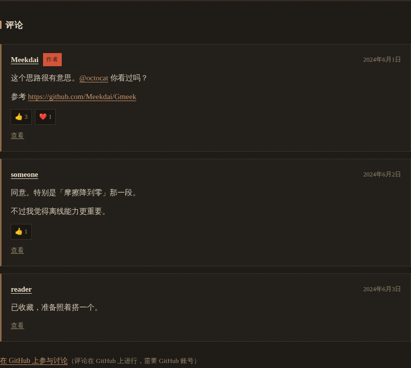
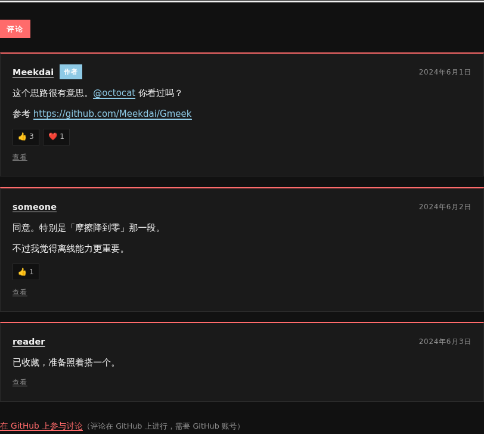

# 评论系统

由 **GitHub Issues 驱动**，客户端渲染，4 套主题各有各的样子。

```javascript
// emeeek.config.js
export default {
  content: { source: 'github-issues', repo: 'yourname/blog' },
  comments: { provider: 'github-issues' },   // repo 自动跟随 content.repo
};
```

本地 Markdown 内容也能有评论区 —— 用 front-matter 的 `issue:` 挂上去：

```yaml
---
title: 为什么我们还需要一个静态博客引擎
issue: 42      # 评论存在 Meekdai/Gmeek 仓库的 Issue #42 里
---
```

---

## 一、为什么不用 giscus / utterances

那两者的做法是：把 GitHub Discussions / Issues 当成一个**外部评论服务**，
你在它们的后台配置，它们在你的页面上挂一个 iframe。代价有三条：

1. **多一个第三方源**（JS 从别人的域名加载）。本站的「零外部请求」是设计
   约束，不是巧合 —— 加一个 iframe 就破了。
2. **多一份配置**（repo / category / mapping 三处要对上）。对不上时表现为
   「评论区一直空着」，看不出是配置错了还是真没人评论。
3. **主题控制不了外观**。iframe 里的样式不由我们决定，
   「4 套主题各自的评论区样式」这件事根本做不到。

而 Emeek 的正文本来就可能就是 Issue（`content.source: github-issues`）——
评论就是那个 Issue 的评论，**repo 与 issue 编号都已知，不需要额外配置**。
主题拿到的是纯 JSON，样式完全在 CSS 里。

## 二、内容在运行时取，不在构建期烘死

评论区的**外壳**在构建期渲染，**内容**在浏览器端填。

为什么内容不烘死：来一条新评论就要重建整站、等 CI 跑完才显示出来 ——
对「评论」这个场景不可接受。

外壳在构建期的好处是：无 JS 的读者也能看到一句可读的话与一个去 GitHub 的
讨论链接（纯静态站的评论区在无 JS 时最容易被做成一片空白）。

```
构建期                                    运行时
renderCommentsShell(target)               fetch(api.github.com/.../comments)
  → <section data-comments-*>               → normalize
    + 「正在加载评论…」                      → 渲染 .c-item
    + 「在 GitHub 上参与讨论」链接           （失败按原因分类显示）
```

**数据属性是两边唯一的接缝**：`data-comments-provider` / `-repo` /
`-issue` / `-limit` / `-reactions` / `-strings`。改了它客户端就找不到地方填。

## 三、不用 token

GitHub 的 Issues API 匿名可读（限流 60 次/小时/IP）。评论条数少时够用。

不配 token 是刻意的：**任何写进静态产物的 token 都是公开的**。
一个站点源码里的 GitHub token 等于把仓库权限送人 ——
要更高额度应当在部署侧用代理，而不是把 token 发到浏览器。

客户端有 60 秒的 `sessionStorage` 短缓存：读者按几下「后退」就可能把
匿名额度用掉，缓存挡的是这个。

## 四、XSS：只识别两种东西，其余全部转义

评论正文是**任意人写的**。这里不渲染完整 Markdown ——
那要引入一个渲染器并在浏览器里处理不可信输入。

只识别：

- `@username` → 指向 GitHub 主页的链接
- `http(s)://...` → 链接

其余全部转义。包括 `<script>`、`` —— 它们显示成字面量
（读者看到 `&lt;script&gt;`），而不是被执行。

**顺序不能反**：必须先 `escapeHtml` 再识别 `@` 与 URL。反过来就是
「在原始文本上做替换，然后转义」，替换出来的标签会被转义掉 ——
或者更糟，某些实现会漏掉一部分。

也刻意**不用 GitHub 返回的 `body` 字段**（HTML 版）。它是 GitHub 自己
sanitize 过的，但我们会把结果插进**我们自己的** DOM 结构里 ——
依赖别人的 sanitize 结果来决定自己的安全性，是把自己安全边界交给第三方。

`scripts/e2e/comments.mjs` 在真浏览器里用三条载荷验证这件事，
其中一条会置位 `window.__XSS__`，断言它必须为 `undefined`。

## 五、失败要分类

四种失败的原因完全不同，但都会让评论区空着：

| 情况 | 提示 | `data-kind` |
| --- | --- | --- |
| Issue 被删 / 编号配错 | 讨论区不存在（Issue #N 可能已被删除） | `not-found` |
| 匿名限流 | 暂无法加载评论（GitHub 接口限流，请稍后再试） | `rate-limit` |
| 其它 HTTP 错误 | 评论加载失败（HTTP 5xx） | `http` |
| 接口返回了非数组 | 评论数据格式异常 | `shape` |
| 真的没有评论 | 还没有评论。 | `empty` |

一句「评论加载失败」对排查毫无帮助。`data-kind` 让主题能用样式区分，
也让测试能断言到具体原因（**这个疏漏被 e2e 抓到过**：`catch` 里写死了
`'error'`，分类白做了）。

## 六、`issue:` front-matter

`local` 源的文章天然没有 Issue 编号。`issue:` 把本地文章挂到某个
GitHub Issue 的讨论上。

这是「本地写文章、GitHub 放评论」这个组合的唯一可行方式 ——
否则不想把草稿过程公开到 Issue 的人就没有评论区可用。

只接受正整数。`issue: abc`、`issue: "#42"`、`issue: 0` 都返回 `null`：

- 报错会让「顺手写错一个可选字段」变成整站构建失败
- 但也**不静默当成 0**（那会去请求 `issue/0`）

两者都是「看起来配了、实际永远加载不出来」，比不配更难排查。

## 七、4 套主题的样式

评论区的外观全在 CSS 里，各主题的语汇不同：

| 主题 | 语汇 |
| --- | --- |
| Minimal | 细线分隔 + 留白，无卡片无圆角 |
| Aurora | 玻璃拟态卡片 + 极光渐变标题 + 渐变作者标记 |
| Inkstone | 信笺（左侧赭石细边）+ 方形头像 + 印章红的作者标记 |
| Magazine | 卡片 + 顶部粗规则线 + 栏目标签式的标题 + 大写的元信息 |

| Minimal | Aurora |
| --- | --- |
|  |  |
|  |  |

| Inkstone | Magazine |
| --- | --- |
|  |  |
|  |  |

## 八、验收

```bash
node scripts/e2e/comments.mjs       # 真浏览器：4 主题 × 16 项 = 64/64
node --test packages/core/tests/comments/   # 单测：转义 / 分类 / 属性注入
bash scripts/e2e/negative-check.sh  # 削弱 XSS 防线必须变红
```

## 九、没做的事

- **不显示评论者的邮箱 / 任何 PII**（Issues API 本来也不给）
- **不做回复树**。GitHub 的评论是平铺的（`in_reply_to` 只在 review 评论里），
  硬造一层树会让「谁是回复谁」变成猜测
- **不做本地评论**。没有后端就无法「存」评论，而引入后端就破了
  「零服务器成本」这条支柱
