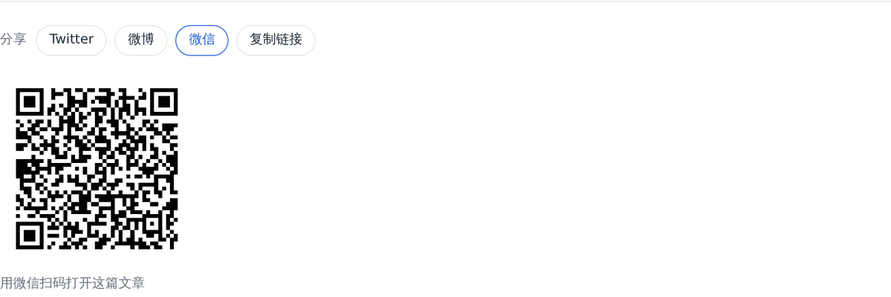
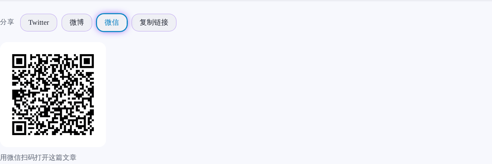
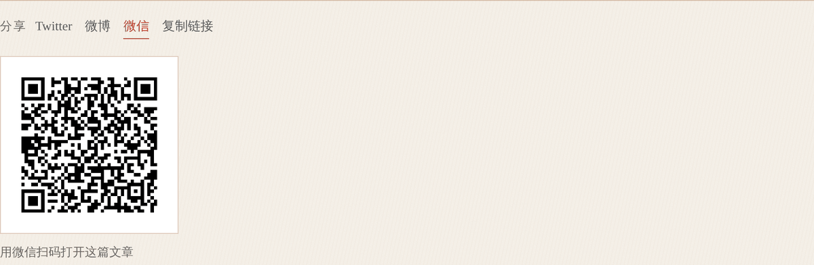
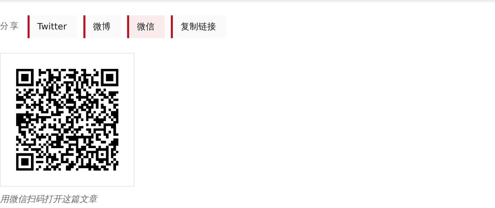

# 社交分享

分享按钮是**纯 `<a>` 标签**。零第三方 JS、零第三方请求、不加载任何 SDK。

```javascript
share: {
  enabled: false,                                              // 默认关闭
  platforms: ['twitter', 'weibo', 'copy'],
  position: 'bottom',                                          // bottom | sidebar | both
  utm_source: 'emeek',
  utm_medium: 'social',
  utm_campaign: null,
  label: '分享',
}
```

---

## 一、为什么不用 SDK

各家分享 SDK（Twitter widgets.js、微博 share.js…）提供的全部能力，
就是把 `https://twitter.com/intent/tweet?url=...` 塞进一个 `<a href>`。
而它们的代价是：

1. **多一个第三方源**（JS 从别人域名加载）—— 本站「零外部请求」是设计约束，不是巧合
2. **多一份会漂移的 DOM 注入** —— 版本升级后页面结构跟着变
3. **加载 SDK 就是给那家平台追踪用户的机会**

所以 Emeek 的分享按钮全部在**构建期**算好。每个平台只是一个
「把标题与地址拼进查询串」的纯函数（[`packages/core/src/share/platforms.js`](../packages/core/src/share/platforms.js)），
可以在测试里逐条断言链接对不对。

### 支持的平台

| id | 跳转 | 说明 |
|----|------|------|
| `twitter` | ✅ | `twitter.com/intent/tweet` |
| `weibo` | ✅ | `service.weibo.com/share/share.php` |
| `telegram` | ✅ | `t.me/share/url` |
| `reddit` | ✅ | `reddit.com/submit` |
| `hackernews` | ✅ | `news.ycombinator.com/submitlink` |
| `email` | ✅ | `mailto:` |
| `wechat` | ❌ | 微信没有 web 分享端点，只能扫码（本地 canvas 绘制） |
| `copy` | ❌ | Clipboard API |

配置里写了**未知名字**会被忽略并告警 —— 不静默，因为
「我配了 reddit 但它没出现」会把人引去改主题（错的方向）。

---

## 二、微信二维码：自己写的编码器

微信没有 web 分享端点（这是它的产品决定）。唯一可行的是**扫码**。
而二维码需要编码算法 —— 常见做法是引 `qrcode` 之类几十 KB 的库，
但那会破「零外部请求」的约束，且库的代码路径里有大量我们用不到的模式。

所以：

- **构建期**：[`packages/core/src/share/qr.js`](../packages/core/src/share/qr.js) 是一个字节模式 QR 编码器
  （版本 1~10 自动选最小、纠错等级 L/M/Q/H、8 种掩码按标准罚分选最优）
- **运行时**：[`client.js`](../packages/core/src/share/client.js) 里有一份同算法的紧凑实现，
  只在**用户真的点了「微信」**时才跑

### 「一份算法两个宿主」怎么保证不漂移

构建期与浏览器端各有一份编码器（同一算法的两个宿主）。
两者一致不是靠自觉，是有断言的：
`tests/share/client-consistency.test.js` 把浏览器端脚本放进 vm，
对同一地址比对两份矩阵**逐格相同**。

另外，真实可扫性由 e2e 保证：`scripts/e2e/share.py` 在真 Chromium 里
点开微信二维码，取回 canvas 像素，用 **OpenCV 的真实解码器**读出地址，
断言它等于当前文章地址。

> 这两层缺一不可：单测能证明「结构没坏」，但只有真解码器能证明
> 「它还叫二维码」。开发时不点「微信」按钮，构建期与运行时的矩阵漂移
> 是永远看不到的 —— 而症状是「扫出来是一个错的地址」。

### 踩过的两个坑（都记在代码注释里）

1. **格式信息的位序**：15 位格式串必须 **MSB 在前**（bit14 → (8,0)）。
   第一版按 LSB 在前写，结果矩阵数据全对、结构自洽、格式信息两处副本也一致，
   但**任何解码器都读不出来**。因为格式信息是解码器定位掩码与纠错等级的入口。
2. **RS 分块必须短块在前**：v1~v4 块等长，怎么排都对；从 v5-Q 开始块长不等，
   顺序决定每个字节落到哪一格。排错时纠错码字、格式信息、版本信息**全都对**，
   只有数据字节的**位置**错位 —— 症状是「v4 及以下都能扫，v5 起全扫不出」。

### 静默区

画布四周留 **4 个模块**的白边（quiet zone）。这是扫码成功率的硬条件，
少了它很多解码器直接读不出来 —— 而「画布看起来还是一个二维码」时完全看不出来。
所以它被抽成可测的 `qrLayout()`，由单测钉住。

---

## 三、地址与 UTM

分享地址必须**绝对**：社交平台是在**它自己的域名**下抓这个链接的，
相对地址（`/posts/hello.html`）会让抓取直接失败。

```
https://your.site/posts/hello.html?utm_source=emeek&utm_medium=social
                                    └──────────── 拼进分享链接的 UTM ───────────┘
```

UTM **只拼在分享出去的地址里**，站内自己的 URL 不带 —— 站点不需要给自己加 UTM。
设 `utm_source: null` 可以去掉对应参数。

拿不到绝对地址（例如手动传了相对路径）时，`appendUtm` **原样返回**，
不拼一个点开 404 的坏链接。

---

## 四、样式与位置

`position` 三档：

- `bottom`：文章底部（默认）。侧栏浮动在手机上会遮内容，不该是默认
- `sidebar`：侧栏粘性浮动条
- `both`：两处都有

底部与浮动条**不是同一个 partial 复用** —— 浮动条是竖向只有图标，
底部是横向带文字标签，标记结构不一样。共用一份 HTML 会逼出一堆
「这里是浮动条所以…」的模板分支。但两者读的是**同一份 `shareView` 数据**，
链接因此不可能分叉。

4 套主题各自写样式（`styles/share.css`），所以看起来是四个产品：
Minimal 描边胶囊、Aurora 极光渐变描边、Inkstone 朱砂下划线、Magazine 分类色带。

移动端（≤640px）按钮收进「分享」开关里，触摸目标 ≥ 44px。

### 4 套主题的分享按钮

| Minimal | Aurora |
| --- | --- |
|  |  |

| Inkstone | Magazine |
| --- | --- |
|  |  |

截图由 `node scripts/screenshots/rest2.mjs` 生成（真 Chromium，1280px）。
每张都是点开「微信」后的实况 —— 二维码是浏览器端实时画出来的。

---

## 五、零 JS 与无 JS

- 纯跳转平台（Twitter/微博/…）是 `<a href>`，**无 JS 也完全可用**
- 微信二维码与复制按钮需要浏览器端；无 JS 时它们点了不会有反应 ——
  所以这两个按钮在无 JS 下不构成「死按钮」的观感问题（它们在无 JS 页面里
  依然可见，但页面本身在无 JS 下也读不出二维码）。这是设计取舍，不是遗漏。
- 只有真的配了 `wechat` / `copy` 时才会内联那段 QR 编码器；
  一个只有纯链接分享按钮的页面不背这个包袱。
