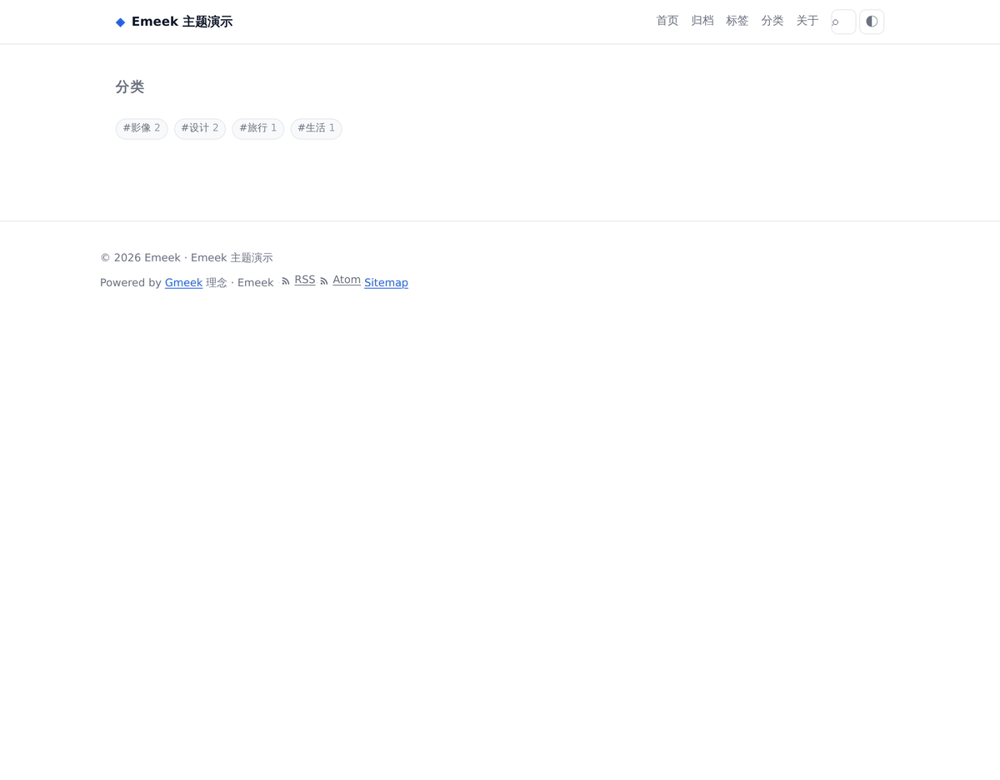
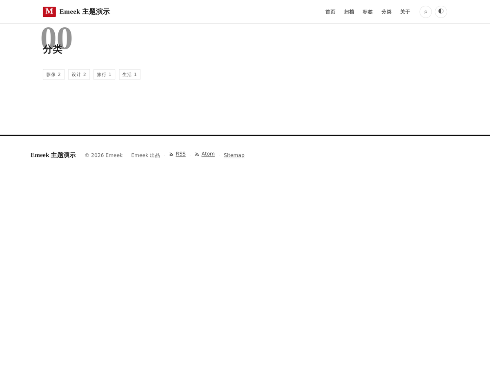

# 内容工作流

草稿 / 定时发布 / 分类 / 构建期校验。这一层守的是两类**不可撤回**的事故：

- 一篇草稿被发出去了（搜索引擎抓到过、RSS 推过、读者看到过）
- 一篇定时文章没到点就上线（你以为它在等，其实它已经发了）

所以这里的规则是**结构性**的，不是「尽量」。

---

## 一、草稿与定时：只有一个判定点

```javascript
workflow: {
  validate: 'warn',                    // off | warn | error
  checks: [],                          // 空 = 全部
  schedule: { enabled: true, graceHours: 0 },
}
```

`partitionPosts()`（[`packages/core/src/workflow/index.js`](../packages/core/src/workflow/index.js)）
把文章分成三堆，并给每一篇一个「为什么」：

| 状态 | 判据 | 进产物？ | 怎么让它上线 |
|------|------|---------|-------------|
| 已发布 | 其余全部 | ✅ | — |
| 草稿 | `draft: true` | ❌ | 把 `draft` 改成 `false` |
| 定时 | `date + graceHours > now` | ❌ | 等时间到，CI 定时重建后自动出现 |

**构建、`emeek drafts` 命令、内容校验读的是同一个函数。**
所以「命令说已发布」与「产物里有它」在结构上不可能分叉 ——
这正是 P3-4b-accel 里「不留两份真相」的同一条原则。

### 草稿优先于定时

既是草稿、又是未来时间 → 归**草稿**。理由：草稿需要人的动作（改成 `false`），
而定时只需要等。把它归到「等定时」会让作者以为「什么都不用做它就会上」。

### graceHours 是「推迟」不是「提前」

`date + graceHours <= now` 才算到点。默认 `0`。

设成 1~2 的作用是躲开**时钟偏差与 CI 调度的抖动**：定时任务每小时跑一次时，
一篇正好卡在整点的文章可能因为几十秒的偏差被算成「还没到」，白等一小时。
名字容易读反，所以写在配置注释与这里两处。

### 草稿绝不进生产：由什么保证

1. 构建期 `partitionPosts` 过滤
2. **全产物扫描**的 e2e 断言（`scripts/e2e/workflow.mjs`）：草稿的 slug 与标题
   不得出现在 `dist/` 下**任何**文件里 —— 页面、sitemap、feed、搜索索引、
   PWA 清单、service worker、acceleration.json 全都扫
3. 每条防线配负向验证（削弱 `draft` 判断 → 测试必须变红）

只断言「没有那篇文章的 HTML」是不够的：feed 与搜索索引里漏一条，
事故照样发生。

---

## 二、分类与标签

- **分类** = front-matter 的 `categories`（Issues 源则可由 Label 映射）
- **标签** = front-matter 的 `tags`

两者的页面形态完全一样，所以**共用同一个布局**（`tags.html`）——
分叉成两个布局只会得到两份迟早漂移的模板。差异只有标题与 href 前缀。

| 页面 | 路径 | 何时存在 |
|------|------|---------|
| 标签总览 | `/tags.html` | 总有 |
| 单个标签 | `/tags/<slug>.html` | 有该标签的文章时 |
| 分类总览 | `/categories.html` | 总有 |
| 单个分类 | `/categories/<slug>.html` | 有该分类的文章时 |

**导航里的「分类」入口只在真的有分类时出现。** 判据是内容（有没有分类），
不是配置开关 —— 一个点进去空无一物的「分类」比没有这一项更像坏了。

---

## 三、构建期内容校验

```javascript
workflow: {
  validate: 'warn',   // off = 不跑；warn = 逐条告警；error = 让构建失败
  checks: [],         // 空 = 全部；可只跑其中几项
}
```

| 检查项 | 抓什么 | 严重度 |
|--------|--------|--------|
| `title` | 没有标题 / 标题是默认值 / 过长 | error / warn / warn |
| `date` | 日期无法解析 / `updated` 早于 `date` | error / warn |
| `markdown` | 未闭合代码块围栏 / 空正文 / 未闭合链接 / Tab 缩进列表 | error / warn |
| `taxonomy` | 标签名含逗号（`tags: a, b` 在 YAML 里是一整个字符串）/ 过长 / 空值 | warn |
| `links` | 本地图片/附件**文件不存在** | warn |
| `internal-links` | 站内链接**没有对应页面** | warn |

### 只查事实，不查判断

刻意**不查**「文章太短」「没有标签」「标题不够吸引人」—— 它们是判断，不是事实。
把判断混进校验会让用户学会「忽略这些警告」，而那会连带把真问题一起忽略。
**一条永远在响的警告等于没有警告。**

### 每条都带「怎么修」

只说「标题为空」没用 —— 作者打开那个文件还是不知道该写什么。
所以每条问题都带 `fix`（一句话的修法）与 `file`（哪个文件，
且只留 `posts/` 之后的部分，不泄漏构建机的绝对路径）。

### 默认 warn，不阻塞

校验是新加的一道关。用户的内容仓库里可能本来就有几条历史问题，
一升级就构建失败是很糟的体验。所以默认 `warn`：问题被逐条说出来，构建照常。
要严格就写 `error`。

### 分类总览页

| Minimal | Aurora | Inkstone | Magazine |
| --- | --- | --- | --- |
|  |  |  |  |

四套主题共用同一个布局，长得完全不同 —— 差异全在 CSS 里。

### 为什么「文件存在性」检查拿不到事实时就跳过

`links` 检查需要知道「项目里到底有哪些文件」。拿不到（例如远程 Issues 源、
或没扫描目录）时**跳过这一项**，而不是凭猜报警 ——
宁可少查一项，也不要让用户去追一个不存在的坏图。
